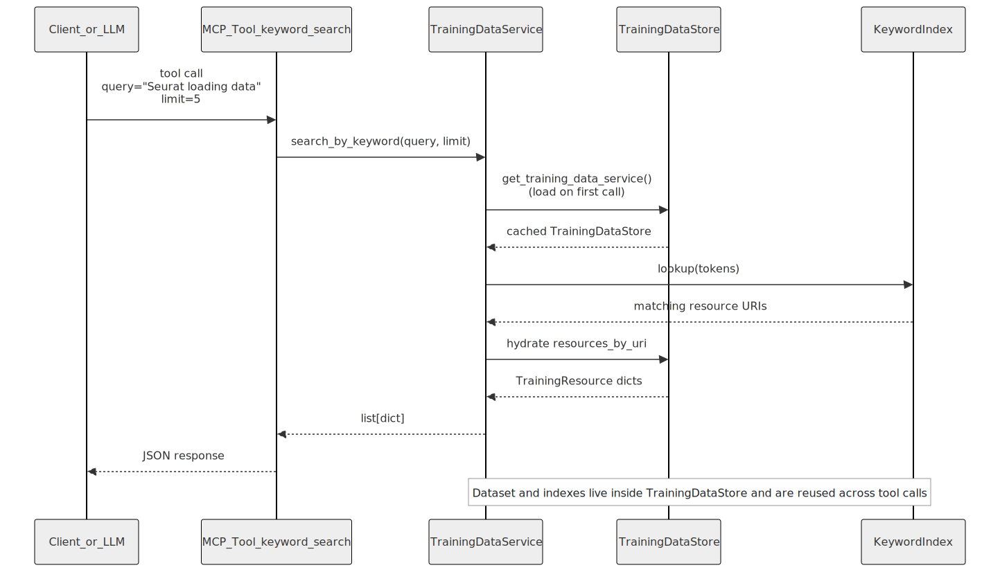

# Introduction

Knowledge graphs can greatly increase the potential of data by revealing hidden relationships and turning it into useful information [@callahan_open_2024]. A knowledge graph is a graph-based representation of data that stores relations between subjects, predicates and objects in triplestores. These entities are typically described in pre-defined ontologies, which increase interoperability and connect data that would otherwise remain isolated in siloed databases. This structured data representation can greatly facilitate complex querying and applications to deep learning approaches like generative AI.

ELIXIR and its Nodes are making a major effort to make the wealth of open training materials on the computational life sciences reusable, amongst others by guidelines and support for annotating training materials with standardized metadata. One major step in standardizing metadata is the use of the Bioschemas training profile [@castro_bioschemas_2023; @gray_bioschemas_2017], which became a standard for representing training metadata. Despite being standardized and interoperable, there is still a lot of potential to turn these resources into valuable information, linking training data across various databases.

In this project, we represented training metadata stored in TeSS as a queryable knowledge graph. By doing so, we were able to find relevant gaps in the metadata that put a contstraint on knowledge graph definitions. To access and query the knowledge graph using large language models (LLM) we developed a model context protocol (MCP) server. Finally, we defined user stories to evaluate the potential of the tool, including construction of custom learning paths, creation of detailed trainer profiles, and connection of training metadata to other databases. These use-cases also shed light on the limits on the currently available metadata, and will help to make future choices on better defined and richer metadata.

# From Bioschemas to knowledge graphs

In order to create a knowledge graph we extracted training metadata from two resources:

- [TeSS](https://tess.elixir-europe.org/) [@beard_tess_2020]: The ELIXIR Training e-Support System (TeSS) is a platform that aggregates training materials, courses, and events from various providers across Europe. TeSS uses the Bioschemas Training profile to annotate its resources with standardized metadata.

- [Galaxy training network](https://training.galaxyproject.org/): The Galaxy Training Network (GTN) provides a collection of training materials and tutorials for the Galaxy platform. The GTN also uses the Bioschemas Training profile to annotate its resources.

Although the Galaxy training network metadata is already available in TeSS, we extracted it separately, as it contains identitifiers for trainers that are not available from TeSS at the moment. In this way, we could evaluate the impact of having trainer identifiers.

While going through the process of building a knowledge graph, we acknowledged that there is large potential to improve the available metadata unique identifiers. Which is also stated in the FAIR principles, stating that digital resources, i.e., data and metadata, are assigned a globally unique and persistent identifier [@wilkinson_fair_2016]. Ideally, the metadata providers associate permanent identifiers for courses, events and course materials that can be preserved between systems. This would for instance allow merging of Bioschemas data that have overlapping course instances. In addition, Organizations could be identified by their [ROR](https://ror.org/) and teachers by [ORCID](https://orcid.org) when available. During the hackathon we worked on merging such nodes, and bringing this data cleaning effort back to the different teams. Our specific suggestions for metadata providers can be found in the individual subchapters below. 

### About and keywords

In the about and keywords properties it is recommended to use ontologies, which would be EDAM in the case of Bioschemas. This is already implemented in TeSS and by many other metadata providers, but for completeness, we mention it here. Example:

```json
"about": [
    {
        "@id": "http://edamontology.org/topic_3474",
        "@type": "DefinedTerm",
        "inDefinedTermSet": "http://edamontology.org",
        "termCode": "topic_3474",
        "url": "http://edamontology.org/topic_3474",
        "name": "Machine learning"
    }
]
```

### Persons and organisations

In properties like:

- author
- instructor
- contributor
- funder
- organiser

We typically specify persons and organisations. Frequently used identifiers for these are ORCiD and ROR respectively. Example:

```json
"author": [
    {
        "@type": "Person",
        "@id": "https://orcid.org/0000-0002-1501-1082",
        "name": "Vincent Emonet"
    },
    {
        "@type": "Organization",
        "@id": "https://ror.org/002n09z45",
        "name": "SIB Swiss Institute of Bioinformatics"
    }
]
```

### Location

For identifying the location, we recommend using OpenStreetMap (OSM) URLs, which can be either:

- **Node** – a single geographic point defined by latitude and longitude.
- **Way** – an ordered sequence of nodes that creates a polyline (e.g., a road) or a closed polygon (e.g., a building outline).
- **Relation** – a container that groups nodes, ways, or  other relations together with specific roles to represent complex  structures such as routes, boundaries, or turn restrictions.

Typically, a way would be used to define a building, and a relation for more complex structures, including cities or countries. Example:

```json
"location": {
    "@type": "Place",
    "@id": "https://www.openstreetmap.org/relation/1684625",
    "address": {
        "@type": "PostalAddress",
        "addressLocality": "Bellinzona",
        "addressCountry": "Switzerland"
    }
}
```

# System architecture and pipeline



Figure 1 summarises how the harvesting scripts, loader modules, indexes, and MCP transports relate to each other. TeSS and GTN harvesters refresh the RDF/Turtle artefacts, the loader deduplicates resources, and the `TrainingDataService` exposes both live and offline tools so MCP-compatible clients can choose their preferred transport.

Because the same `TrainingDataService` instance powers every tool invocation, we can run lightweight experiments from different MCP-compatible chat clients without reloading the datasets. This was particularly useful during the hackathon sessions where we compared the responses from Claude Desktop, Copilot, and custom CLI tooling against the same offline store while still allowing the live TeSS API tool to act as a fallback for breaking changes in the harvesters.

## Offline processing pipeline



Figure 2 zooms in on the offline path from TTL files to immutable indexes. Each step maps to the loader package: `loader.graph` parses RDF, `loader.parser` normalises subjects into `TrainingResource` objects, `loader.dedupe` keeps the richest representation, and `_build_indexes` materialises keyword, provider, date, location, and topic indexes alongside dataset statistics.

Centralising these steps made it easier to share data-quality findings with the TeSS and GTN maintainers. For example, we could demonstrate exactly which triples were dropped during deduplication and how many additional resources surfaced when a provider normalised their `schema:url` usage. The same pipeline also emits summary statistics that informed our prioritisation of identifier recommendations described earlier in this section.

## Data model and indexes



Figure 3 depicts the relationship between `TrainingResource`, `CourseInstance`, and the five indexes. Course instances capture the geo-temporal attributes consumed by the date and location indexes, while provider, keyword, and topic indexes bind normalised strings to resource URIs. The diagram clarifies which metadata fields drive each tool.

# MCP server

To facilitate access to the knowledge graph by AI systems and humans, we developed a Model Context Protocol (MCP) server that exposes a suite of tools for searching and querying training materials. The MCP server provides both live and offline search capabilities. The live tool `search_training_materials` directly queries the TeSS platform via its API. For offline access to the harvested and deduplicated knowledge graph, we implemented six search tools: `keyword_search` enables free-text searches across training resources, `provider_search` filters materials by provider organization, `location_search` finds courses by geographic location, `date_search` identifies courses within a specified date range, and `topic_search` filters by subject matter using ontology terms. Additionally, the `dataset_stats` tool provides high-level diagnostics about the loaded datasets. For advanced use cases, the server exposes `execute_sparql_query`, which allows users to formulate and execute custom SPARQL queries directly against the knowledge graph. These tools together enable flexible querying of training metadata through natural language interfaces, supporting both simple discovery tasks and complex analytical queries.

## Tool execution lifecycle



Figure 4 highlights the round trip between an MCP client, the tool entry point, the cached `TrainingDataStore`, and the supporting indexes. The singleton service ensures the large RDF graphs are parsed only once, while each strategy method (`search_by_keyword`, `search_by_provider`, etc.) delegates to the relevant index before hydrating JSON responses. This separation keeps latency low for LLM-powered clients and makes it explicit when the live TeSS API is used instead of the offline store.

The sequence also documents how we guard against stale caches: if the TTL harvest is refreshed, restarting the MCP server rebuilds the store and indexes in roughly 30 seconds on a laptop, whereas individual tool calls resolve in well under a second. This predictable lifecycle allowed us to integrate the MCP server into GitHub Copilot and Claude Desktop without introducing client-specific state handling.

# Defining user stories and testing

To work towards a valuable end-user experiences, we created a list of user stories. These are potential user experiences that are written in the following format:

- As a [user persona]
- I want to [do task]
- …so that [outcome/benefit]

Examples of the defined user stories are:

- As a trainer of visualisation techniques

-  want to find other trainers in Germany and France

- …so that I can collaborate on developing new training events for our national audiences

Or:

- As a bioinformatics scientist

- want to define a learning path of training materials and/or events

- …so that I can become a specialist in artificial intelligence within the following specified time and resources: I have 6 months, a workload of 14 days, I live in Sweden and I can travel within Europe once

These user stories were directly used as prompts to test the tool. For some user stories we added additional prompts, such as 'Provide the urls of the training material data' or 'Report only materials that are on GitHub'. Responses of the chatbot can be found in the [repository](https://github.com/elixir-europe-training/ELIXIR-TrP-KG-training-metadata) at `user_story_results`. The user stories are available from a [Google Spreadsheet](https://docs.google.com/spreadsheets/d/1QomHwBi9SO8PupcYewexE6E7DRE3N7EJmh8WDwHpBgE/edit?usp=sharing). 



Figure 5 summarises the five phases of the project, from harvesting and loader refactors through to user-story validation and documentation. We recorded 11 prompts during the `release-0.0.1-beta` cycle and reran the highest-priority scenario for `release-0.0.2-beta` after tightening the indexes, which provided concrete evidence of how well the MCP server answers persona-driven questions.

Most prompts succeeded without manual intervention, but the replay revealed two recurring blockers: missing persistent identifiers for instructors (which limited collaborator discovery stories) and under-specified course locations (which reduced the precision of location-based filtering). Feeding these findings back into the identifier recommendations created a tight feedback loop between the qualitative user-story evaluations and the quantitative loader statistics.

# Discussion

There is a wealth of metadata on training courses, events and materials available within the ELIXIR ecosystem and beyond. In this project we aimed to increase its value for the end user. For example, by enabling querying in natural language with questions related to trainers and their expertise, metadata quality and learning paths. The answers to these questions by LLMs using the MCP were usually of high quality and complete, showing that there is large potential to put the metadata to use to a wide range of end users, ranging from trainers, metadata curators to learners. 

Although the metadata we worked with was represented in Bioschemas format, the metadata was not in a shape so that a knowledge graph query can make use of all the possible links. For example, persons, organisations and locations typically were not associated with an persistent identifier (`@id`), resulting in unlinked nodes. This first attempt to create a knowledge graph out of this metadata provided therefore valuable cues to metadata providers to interlink their data with other resources. 

The use of MCP for scientific applications is promising, because, if combined with a LLM, it allows for natural language querying while providing information from a trusted resource. In addition, multiple MCP can be used at the same time by the end user, which allows the user to combine multiple trusted resources. In our case, we evaluated an interesting combination of using our MCP with the [GitHub MCP](https://github.com/github/github-mcp-server). Since many training materials were hosted on GitHub, we could use our MCP to query the metadata, and combine that with the actual content of the training material on GitHub. For example, to get information on specific part of tutorial organized by a specific institution. Showing the potential for linking and combining resources by makign use of MCP modularity. 

# Future work

Future work regarding this project includes:

- Support the application of the recommendations for using identifiers in bioschemas markup to metadata providers and TeSS
- Providing weekly knowledge graph updates through GitHub actions
- Feed the results of this project forward into the German BioHackathon project '[On the path to machine-actionable training materials](https://www.denbi.de/de-nbi-events/1939-4th-biohackathon-germany-on-the-path-to-machine-actionable-training-materials)'


## Acknowledgements

We thank the organizers of the Biohackathon Europe 2025 for organizing the event and travel support for some of the authors.

## Supplemental information

- [GitHub repository](https://github.com/elixir-europe-training/ELIXIR-TrP-KG-training-metadata)
- [Google sheet](https://docs.google.com/spreadsheets/d/1QomHwBi9SO8PupcYewexE6E7DRE3N7EJmh8WDwHpBgE/edit?usp=sharing) with user stories


## References
